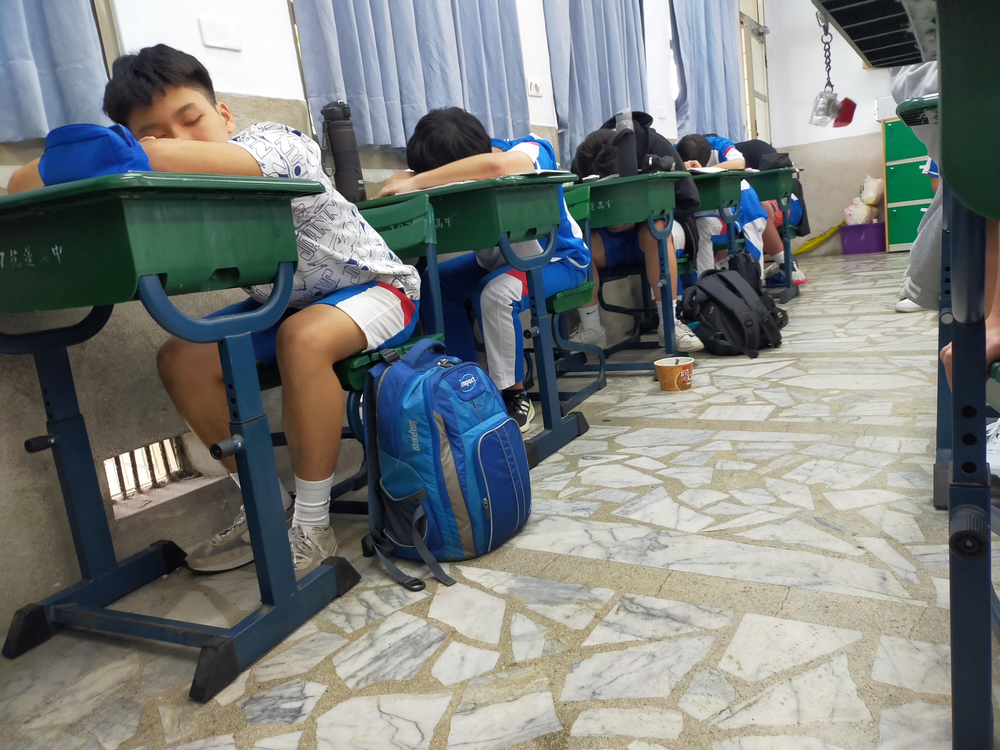

# 高斯消去法 (高二蔣數A，"蔣"字可忽略)
項目名稱是"早上數A，晚上GTA"，但GTA較少上線(佛系玩法，通常是一季上線一次) 
用C++做的，因為我那時忘記Python的陣列，要翻講義很麻煩

## 動機
做為學習歷程檔案用，順便加數學平時分數。數學課上到矩陣這一章時，課本是先寫高斯消去法再引申到矩陣。老師在教這一個段落時說「這要寫程式去跑，電腦很適合處理這種大量又簡單的加減運算」，因此，我就在課堂上構思並草稿這個程式，並在下課時完成。之後則是在午休讓這程式能判斷各種問題情況。

## 過程
我先構思這個東西該如何寫，在數學講義上做草稿，Debug幾次，就成功製作出了這個程式。那時的執行力的強度跟探究實作課跑出去用放大鏡燒木屑時一樣。然而，也有一些重要的bug需要處理，在排除使用者是猴子外，有可能會有多個數字對應到變數、變數是0或∞甚至∉ℝ，因此增加了一些判斷式進去；關於後面要把函數由下至上處理的部分，因為我懶得再寫一次迴圈，而用了很偷懶的方法，雖然在部分情況下問題類型會誤判，但至少可以發現問題，且在講義的題目是沒有問題的。

## 心得
這過程讓數學老師發現我寫程式的能力，也因此他在參考了我的學測成績後，建議我讀應用數學系；但是因為我對硬體(例如Arduino)也有興趣，因此選擇了以電機為偏好。也因為我那時把這個成果做出，使我的那時的數學非常不錯，甚至在AMC12拿到證書；我的數學與programing能力也在此後備受肯定，也得到很多參加檢定與比賽的機會，如之後的APX數理能力檢定，數學甚至是頂標(前5%)。
 
 
 
 
 

# 然後現在因為一些trouble導致我的高三數學有些風險

我之前發現講桌會有用完的發泡錠罐子，那時就有一些特殊的點子，丟一顆發泡錠並裝水封蓋，接著內部快速產生大量二氧化碳，壓力在定容定溫下正比於莫爾數，達到閾值就會打破靜力平衡；然後看到蓋子成拋物線被壓力彈得老遠，然後可能會掉到同學的頭上。關於陷阱卡的部分下一期再來講解。

## 這是實驗裝置

  
   

# shh...，不要吵醒他們
誰上課沒有睡過覺，對吧？ 
但是連成直線的機率似乎很低，在6x6的方格，只考慮橫軸與橫軸時，要連成數條直線的機率大約是19²/649264 ≈ 0.000556；機率超級低，因此我在上課時總會檢查其是否有連線的可能性，並開始玩起"睡覺賓果"，看最多可以連幾條線，最多的應該是兩條在化學課，這也讓我上課增添一些樂趣，也算起了機率。

  
   

