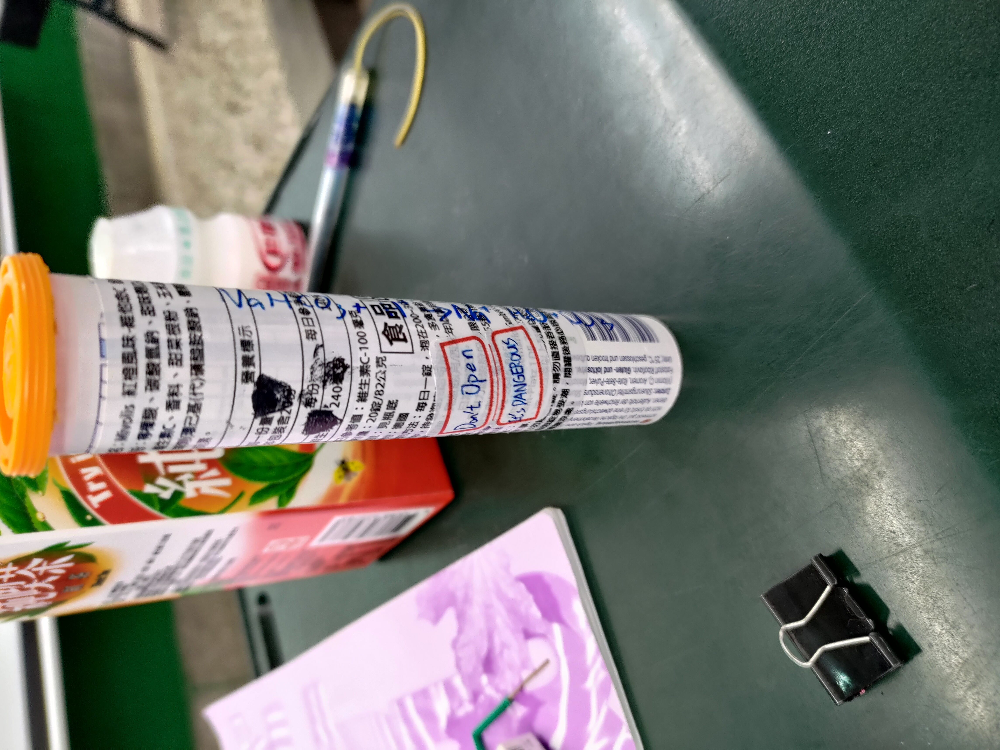

# 高斯消去法 (高二蔣數A，"蔣"字可忽略)

項目名稱是"早上數A，晚上GTA"，但GTA較少上線

用C++做的，因為我那時忘記Python的陣列，要翻講義很麻煩

做為學習歷程檔案用，順便加數學平時分數；但高三時被另一件事扣分(見底下)。數學課上到這一章時，老師說"可以寫程式去運行"，我就產生了一些點子，並且在構思這個東西該如何寫，先在數學講義上做草稿，Debug幾次，就成功寫出來了。那時的執行力的強度跟探究實作課跑出去用放大鏡燒木屑時一樣。

## 然後現在我的高三數學要被扣分了，因為我讓數學老師翻開"陷阱卡"

這件事發生在11/19/2024 下午第六節課

我之前在空的發泡錠罐子裝水，混在其他還有東西的罐子之中(中獎機率是0.25)。不巧的是，數學老師要泡發泡錠，正好打開了那個罐子；水流出來，並且弄濕他的褲子。所以我的數學成績現在有點危險，課堂平時成績會被扣10分，但是平時考都在90以上，因此影響"應該"不會太大，除非這一頁被數學老師發現。

數學老師之名言："因為你對我使用陷阱卡，因此我只好被動地使用扣分卡"

總結：數學分數-2，但是學期總分仍是全班第三(還上台領獎)

## 就是這鬼東西害我被扣分，但是很有趣

  
   

